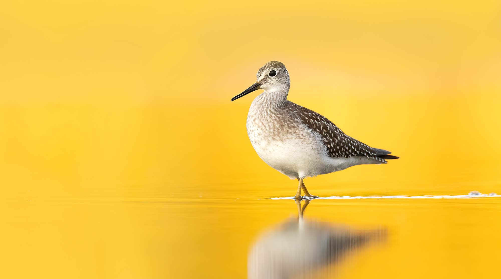
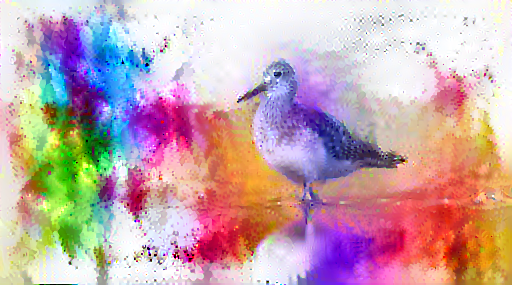

# Image Style Transfer

## Introduction

Neural Style Transfer is an algorithm that combines the content of one image with the style of another image using convolutional neural networks. This project implements Neural Style Transfer using TensorFlow, a popular deep learning framework.

## Usage

### Importing and Configuring Modules

```python
import os
import tensorflow as tf
import IPython.display as display
import matplotlib.pyplot as plt
import matplotlib as mpl
import numpy as np
import PIL.Image
import time
import functools
```

### Loading Images

```python
content_path = '/content/yellowlegs_small.jpg'
style_path = '/content/color.jpg'

content_image = load_img(content_path)
style_image = load_img(style_path)
```

### Visualizing Input Images

```python
plt.subplot(1, 2, 1)
imshow(content_image, 'Content Image')

plt.subplot(1, 2, 2)
imshow(style_image, 'Style Image')
```

### Performing Fast Style Transfer using TF-Hub

```python
import tensorflow_hub as hub

hub_model = hub.load('https://tfhub.dev/google/magenta/arbitrary-image-stylization-v1-256/2')
stylized_image = hub_model(tf.constant(content_image), tf.constant(style_image))[0]
tensor_to_image(stylized_image)
```

## Documentation

For detailed documentation and usage instructions, please refer to the README.md file in the GitHub repository: [link-to-github-repo](https://github.com/Bishwajit-Shil/Image-style-transfer/blob/main/style_transfer.ipynb)


Feel free to adjust and expand the documentation as needed. Make sure to replace "your-username" and any placeholder links with the appropriate information for your GitHub repository.

## Source Image

<p align="center">
  
</p>

## Style Image
<p align="center">
  
</p>

## Output Image
<p align="center">
  
</p>
